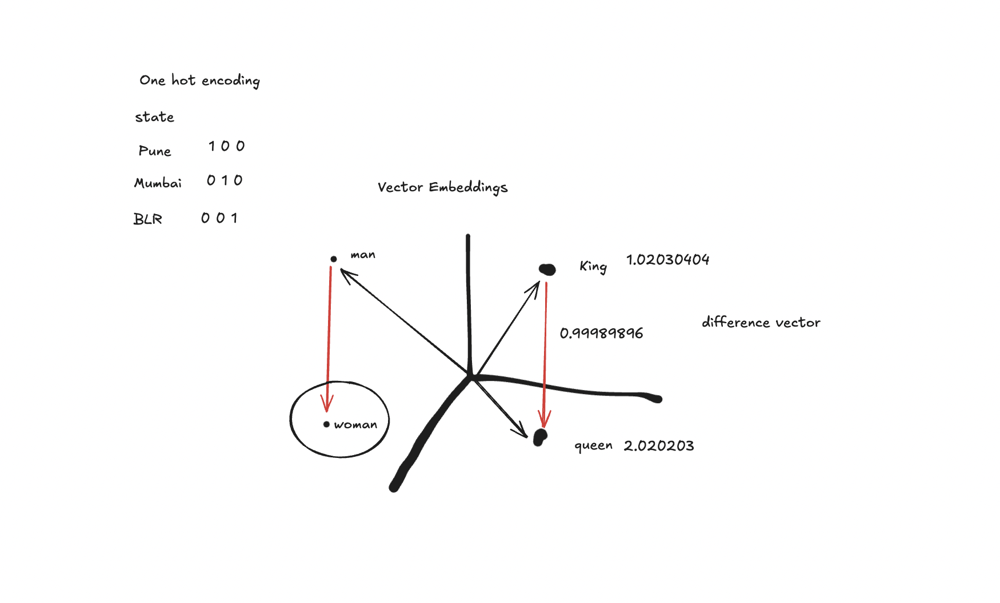

# Deep-Learning-AI

A repository dedicated to exploring and implementing Deep Learning and AI concepts with practical applications.

## Table of Contents
- [AI Roadmap](#ai-roadmap)
- [Theory](#theory)
- ## **Transformers** (3B1B)

  **Generative Pre-trained Transformer Lecture 1**

  ### Introduction

  The Generative Pre-trained Transformer (GPT) is a type of neural network model that has revolutionized the field of artificial intelligence (AI). In this chapter, we will delve into the inner workings of the GPT model and explore its applications.

  ### What is a Transformer?

  A transformer is a specific kind of neural network model that is designed to handle sequential data, such as text or audio. It is the core invention underlying the current boom in AI.

  ### How does a Transformer work?

  A transformer works by breaking down the input data into smaller pieces called tokens, which are then associated with vectors that encode their meaning. These vectors are then passed through a series of operations, including attention blocks and multi-layer perceptron blocks, to produce a final output.

  ### Attention Blocks

  Attention blocks are a key component of the transformer model. They allow the vectors to talk to each other and pass information back and forth to update their values. This process is repeated multiple times, with each iteration allowing the vectors to become more informed about the context in which they are being used.

  ### Multi-Layer Perceptron Blocks

  Multi-layer perceptron blocks are another important component of the transformer model. They are used to update the vectors by asking a series of questions about each vector and then updating the vector based on the answers to those questions.

  ### Training a Transformer

  Training a transformer involves using a large dataset of text or other sequential data to fine-tune the model's parameters. The goal is to enable the model to predict what comes next in a sequence, given a snippet of text or other input.

  ### Applications of Transformers

  Transformers have many applications, including:

  * **Text generation**: Transformers can be used to generate text, such as chatbot responses or articles.
  * **Language translation**: Transformers can be used to translate text from one language to another.
  * **Image generation**: Transformers can be used to generate images, such as those produced by DALL-E and Midjourney.

  ### GPT-3

  GPT-3 is a specific implementation of the transformer model that has been trained on a massive dataset of text. It has 175 billion parameters and is capable of generating coherent and context-specific text.

  ### Embedding Matrix

  The embedding matrix is a key component of the transformer model. It is used to map input tokens to vectors that encode their meaning. The embedding matrix has a single column for each word in the vocabulary, and the values in each column are learned during training.

  ### Softmax Function

  The softmax function is used to normalize the output of the transformer model, ensuring that it forms a valid probability distribution. It takes an arbitrary list of numbers and returns a list of values between 0 and 1 that add up to 1.

  ### Temperature

  The temperature is a hyperparameter that controls the level of randomness in the output of the transformer model. A higher temperature means that the model is more likely to generate unexpected or creative text, while a lower temperature means that the model is more likely to generate predictable text.

  **Notes**
  --------

  * The transformer model is a type of neural network that is designed to handle sequential data.
  * The attention block is a key component of the transformer model, allowing vectors to talk to each other and pass information back and forth.
  * The multi-layer perceptron block is another important component of the transformer model, used to update vectors by asking a series of questions about each vector.
  * The embedding matrix is used to map input tokens to vectors that encode their meaning.
  * The softmax function is used to normalize the output of the transformer model, ensuring that it forms a valid probability distribution.
  * The temperature is a hyperparameter that controls the level of randomness in the output of the transformer model.

- [Project Content](#project-content)
  - Encoders
    - [Sentence Similarity Analysis](#1-sentence-similarity-analysis)
    - [Sentence Embedding Visualization](#2-sentence-embedding-visualization)
    - [Contextual Clustering](#3-contextual-clustering)
  - langgraph
    - [AI Agents](#4-ai-agents)
    - [Basic Agents](#5-basic-agents)
    - [Resume Fitting](#6-resume-fitting)
    - [Text Analysis](#7-text-analysis)
- [Getting Started](#getting-started)
- [Future Goals](#future-goals)
- [Contributing](#contributing)
- [License](#license)

## AI Roadmap

1. [Neural Networks and Deep Learning](https://youtube.com/playlist?list=PLtBw6njQRU-rwp5__7C0oIVt26ZgjG9NI&si=PeV7gBF7SKNPBWpT) (Videos 1 - 6)
2. [Langgraph](https://www.youtube.com/watch?v=jGg_1h0qzaM&ab_channel=freeCodeCamp.org)
3. [Transformers and Attention](https://youtu.be/wjZofJX0v4M?si=j4KB1PRkI451d7dE)

## Theory

Experiment taken from the 3B1B Transformers video.
Experiment shows that in the embedding space, similar words are close to each other, yes and it also shows that vector addition and subtraction also have semantic meaning in vector space.

## Project Content

### 1. Sentence Similarity Analysis

This project implements semantic similarity comparison between sentences using transformer-based embeddings.

#### Features
- Utilizes SentenceTransformer with 'all-MiniLM-L6-v2' model
- Computes pairwise cosine similarities between input sentences
- Presents results in a clear, tabulated format
- Demonstrates practical application of sentence embeddings

#### Example Use Cases
- Finding similar sentences or documents
- Semantic text matching
- Content-based recommendation
- Duplicate detection

#### Technical Details
- Model: all-MiniLM-L6-v2 (efficient and accurate for similarity tasks)
- Similarity metric: Cosine similarity
- Output format: Grid-formatted table with pairwise similarities

### 2. Sentence Embedding Visualization

This project demonstrates semantic similarity analysis and visualization of text embeddings using state-of-the-art transformer models.

### 3. Contextual Clustering

### 4. AI Agents

### 5. Basic Agents

### 6. Resume Analysis

### 7. Text Analysis

#### Features
- Uses SentenceTransformer with 'paraphrase-mpnet-base-v2' model for generating embeddings
- Calculates semantic similarity between question pairs
- Provides 3D interactive visualization of embedding spaces
- Demonstrates dimensionality reduction using MDS (Multidimensional Scaling)

#### Key Findings
From the sample output:
- Questions with similar semantic meaning show high similarity scores (80-90%)
- Unrelated questions show very low similarity scores (10-20%)
- The 3D visualization clearly clusters semantically related questions together

#### Technical Implementation
- Sentence embeddings using SentenceTransformer
- 3D visualization using Plotly
- Dimensionality reduction using scikit-learn's MDS
- Dataset: Quora Question Pairs

## Completed Projects
1. [Langgraph][https://www.youtube.com/watch?v=jGg_1h0qzaM&ab_channel=freeCodeCamp.org]

## Future Goals

1. [Train your own LLM](https://youtu.be/9Ge0sMm65jo?si=i50q3HW0K-g4NOfp)

## Contributing

## License