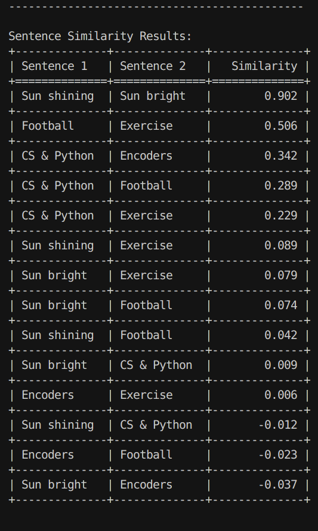

# Deep-Learning-AI

A repository dedicated to exploring and implementing Deep Learning and AI concepts with practical applications.

## Table of Contents
- [AI Roadmap](#ai-roadmap)
- [Project Structure](#project-structure)
- [Projects](#projects)
  - Encoders
    - [Sentence Similarity Analysis](#1-sentence-similarity-analysis)
    - [Sentence Embedding Visualization](#2-sentence-embedding-visualization)
    - [Contextual Clustering](#3-contextual-clustering)
  - langgraph
    - [AI Agents](#4-ai-agents)
    - [Basic Agents](#5-basic-agents)
    - [Resume Fitting](#6-resume-fitting)
    - [Text Analysis](#7-text-analysis)
- [Getting Started](#getting-started)
- [Future Goals](#future-goals)
- [Contributing](#contributing)
- [License](#license)

## AI Roadmap

1. [Neural Networks and Deep Learning](https://youtube.com/playlist?list=PLtBw6njQRU-rwp5__7C0oIVt26ZgjG9NI&si=PeV7gBF7SKNPBWpT) (Videos 1 - 6)
2. [Langgraph](https://www.youtube.com/watch?v=jGg_1h0qzaM&ab_channel=freeCodeCamp.org)
3. [Transformers and Attention](https://youtu.be/wjZofJX0v4M?si=j4KB1PRkI451d7dE)

## Project Structure

### 1. Sentence Similarity Analysis

This project implements semantic similarity comparison between sentences using transformer-based embeddings.

#### Features
- Utilizes SentenceTransformer with 'all-MiniLM-L6-v2' model
- Computes pairwise cosine similarities between input sentences
- Presents results in a clear, tabulated format
- Demonstrates practical application of sentence embeddings

#### Example Use Cases
- Finding similar sentences or documents
- Semantic text matching
- Content-based recommendation
- Duplicate detection

#### Technical Details
- Model: all-MiniLM-L6-v2 (efficient and accurate for similarity tasks)
- Similarity metric: Cosine similarity
- Output format: Grid-formatted table with pairwise similarities

### 2. Sentence Embedding Visualization

This project demonstrates semantic similarity analysis and visualization of text embeddings using state-of-the-art transformer models.

### 3. Contextual Clustering

### 4. AI Agents

### 5. Basic Agents

### 6. Resume Analysis

### 7. Text Analysis

#### Features
- Uses SentenceTransformer with 'paraphrase-mpnet-base-v2' model for generating embeddings
- Calculates semantic similarity between question pairs
- Provides 3D interactive visualization of embedding spaces
- Demonstrates dimensionality reduction using MDS (Multidimensional Scaling)

#### Key Findings
From the sample output:
- Questions with similar semantic meaning show high similarity scores (80-90%)
- Unrelated questions show very low similarity scores (10-20%)
- The 3D visualization clearly clusters semantically related questions together

#### Technical Implementation
- Sentence embeddings using SentenceTransformer
- 3D visualization using Plotly
- Dimensionality reduction using scikit-learn's MDS
- Dataset: Quora Question Pairs

## Completed Projects
1. [Langgraph][https://www.youtube.com/watch?v=jGg_1h0qzaM&ab_channel=freeCodeCamp.org]

## Future Goals

1. [Train your own LLM](https://youtu.be/9Ge0sMm65jo?si=i50q3HW0K-g4NOfp)

## Contributing

## License